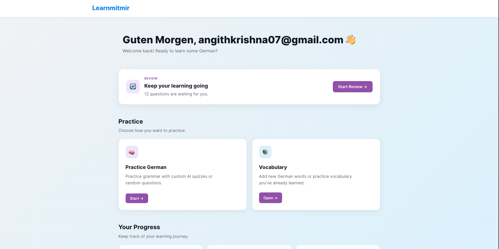
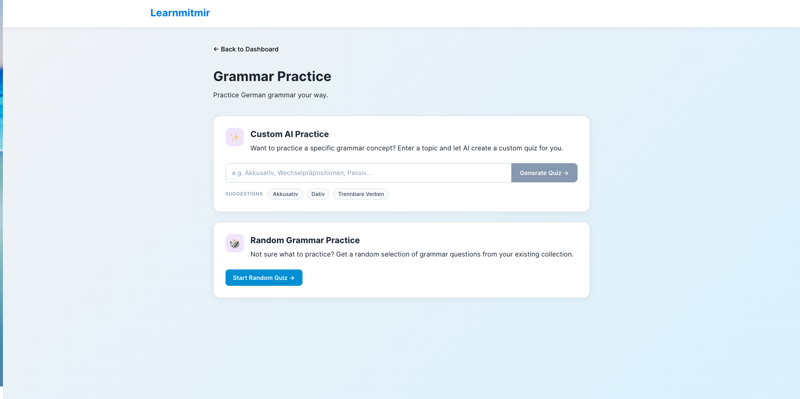
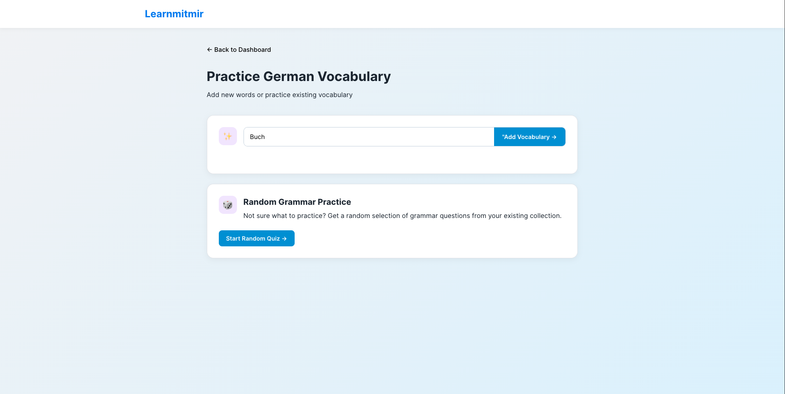
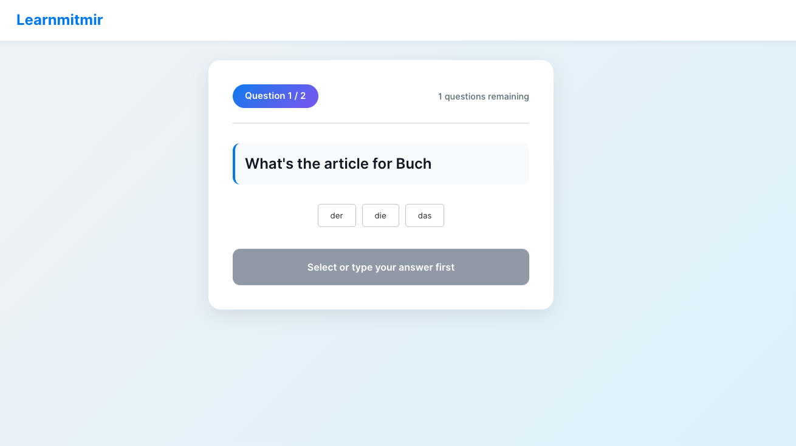

# learnmitmir 🇩🇪

An AI-assisted German language learning application built with React and TypeScript.

learnmitmir was created as a personal project to help me improve my German vocabulary and grammar, particularly German noun articles, while also giving me practical experience building a full-stack web application.

The application combines Firebase, dictionary data, AI-generated exercises, and spaced repetition to create a personalized learning experience.

---

## 📸 Screenshots

### Dashboard

The dashboard provides access to grammar practice, vocabulary learning, and review sessions.



---

### Grammar Quiz

Grammar exercises can be generated and practiced through the quiz interface.



---

### Vocabulary

Vocabulary words can be searched and saved for later practice. Dictionary information such as the article, part of speech, and definition is retrieved automatically.



---

### Spaced Repetition Review

The application uses an SM-2 based spaced repetition system to schedule questions for review.



---

## ✨ Features

- German grammar practice
- AI-assisted exercise generation
- German vocabulary lookup
- Automatic noun article detection
- Vocabulary persistence using Firebase Firestore
- Interactive vocabulary article quizzes
- User authentication
- Spaced repetition using the SM-2 algorithm
- Personalized review scheduling
- Multiple question formats
- React-based interactive UI

---

## 🧠 How It Works

The application separates learning content from the presentation and review systems.

### Grammar Questions

```text
Question data
     ↓
Firestore
     ↓
Question retrieval
     ↓
QuestionRenderer
     ↓
User answer
     ↓
SM-2 review calculation
     ↓
Next review date
```
## Vocabulary 
```text
German word
     ↓
Dictionary API
     ↓
Article / POS / Definition
     ↓
VocabularyWord
     ↓
Firestore
     ↓
Vocabulary → Question conversion
     ↓
QuestionRenderer
```
 ## 🛠️ Tech Stack
Frontend
  React
  TypeScript
  React Router
Backend / Services
  Firebase Authentication
  Firebase Firestore
  Vercel API routes
  OpenAI API
  Free Dictionary API
Learning System
  SM-2 spaced repetition algorithm